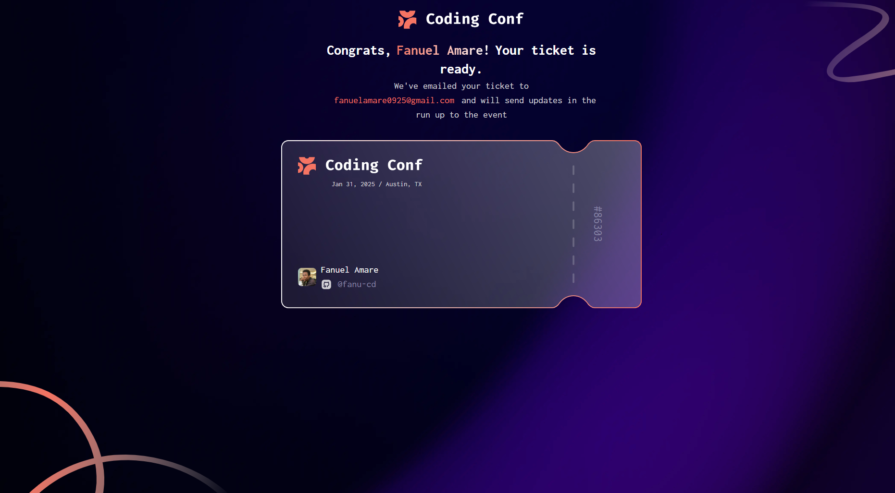

# Frontend Mentor - Conference ticket generator solution

This is a solution to the [Conference ticket generator challenge on Frontend Mentor](https://www.frontendmentor.io/challenges/conference-ticket-generator-oq5gFIU12w). Frontend Mentor challenges help you improve your coding skills by building realistic projects.

- [Overview](#overview)
  - [The challenge](#the-challenge)
  - [Screenshot](#screenshot)
  - [Links](#links)
- [My process](#my-process)
  - [Built with](#built-with)
  - [What I learned](#what-i-learned)
- [Author](#author)
- [Acknowledgments](#acknowledgments)

## Overview

### The challenge

Users should be able to:

- Complete the form with their details
- Receive form validation messages if:
  - Any field is missed
  - The email address is not formatted correctly
  - The avatar upload is too big or the wrong image format
- Complete the form only using their keyboard
- Have inputs, form field hints, and error messages announced on their screen reader
- See the generated conference ticket when they successfully submit the form
- View the optimal layout for the interface depending on their device's screen size
- See hover and focus states for all interactive elements on the page

### Screenshot

### Links

- Solution URL: https://github.com/Fanu-Cd/frontend-mentor-coding-conf
- Live Site URL: https://frontend-mentor-coding-conf.vercel.app/

### My process

### Built with

- Semantic HTML5 markup
- CSS custom properties
- Flexbox
- CSS Grid-HTM
- Mobile-first workflow
- [React](https://reactjs.org/) - JS library
- [Tailwindcss](https://tailwindcss.com/) - CSS Framework
- [React dropzone](https://react-dropzone.js.org/) - JS library for drag and drop
- [React hook form](https://react-hook-form.com/) - JS library for form handling
- [Yup](https://www.npmjs.com/package/yup) - Form schema builder
- [Hookform resolvers](https://www.npmjs.com/package/@hookform/resolvers) - Validation library integration
- [Vite](https://vite.dev/) - Build tool

### What I learned

Building the conference ticket generator taught me:

- State Management: Using useState to handle form data and dynamic changes.
- Form Handling: Managing user input, validation, and rendering personalized ticket previews.
- CSS for Responsiveness: Implementing responsive and visually appealing layouts.
- File Handling: File uploads as well as drag and drops, together with previews
- Accessibility: Ensuring better UX with clear labeling and mobile responsiveness.

This project improved my front-end skills, particularly in React and CSS.

## Author

- Website - [Fanuel Amare](http://fanuel-amare-personal-portfolio-v2.vercel.app/)
- Frontend Mentor - [@Fanu-Cd](https://www.frontendmentor.io/profile/Fanu-Cd)